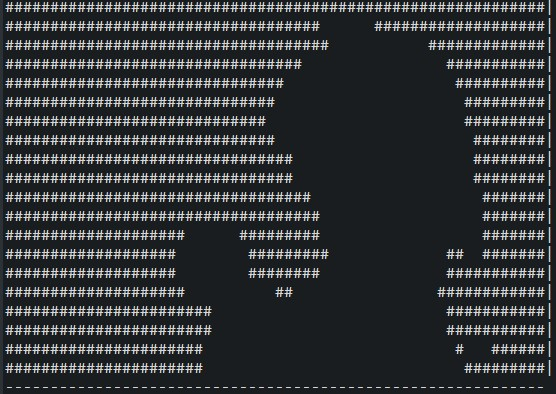

# badapple-renderer
Simple example for rendering BadApple (or other Videos) in ASCII. Can also render videos on keyboards.
Java knowlege is required to use.



# Installation
### For ASCII only.
- Install **OpenCV** !! **451** !! (or just get the binaries)
- Add the included **java wrapper** .jar file to build path
- Fill out the OpenVC .dll path in the source code
  - !! **opencv_javaXXX.dll** !! not the regular dll file
- Fill out the video and audio paths
  - You can use ffmpeg to generate the audio ```ffmpeg -i <in> out.wav```
  - Video has to be in a format OpenCV **can handle**
    - Tested with mp4
    - Try to convert it to mp4 with ffmpeg ```ffmpeg -i <in> out.mp4``` if does not work
    
### For Keyboards (Coolermaster).
- **All of above**
- Put "SDLDLL.dll" from the [SDK](https://templates.coolermaster.com/) into ```[project folder]/lib/```
